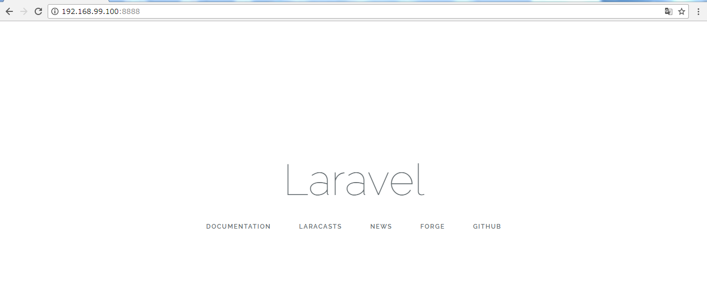
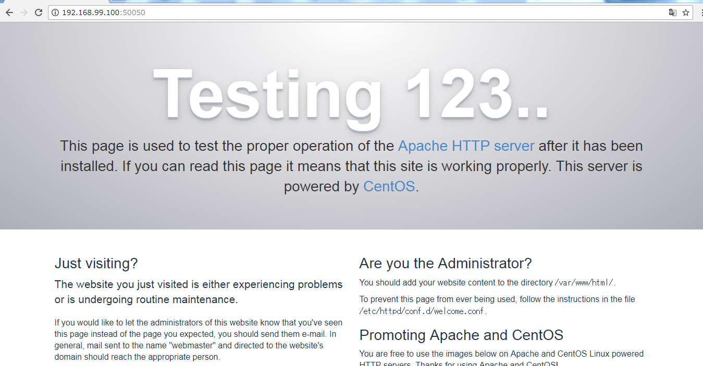

# theme1 環境構築  

## 実行環境  
Window7 64-bit  

## 行った作業  

### docker の install  
<http://devcenter.magellanic-clouds.com/learning/docker-toolbox.html>  
上記urlにしたがってDocker Toolboxをインストール。

### 公開鍵の作成  
**Docker Quickstart Terminal** を起動。  
作業ディレクトリの作成＆移動  
`$ mkdir docker`  
`$ cd docker`  
秘密鍵の作成  
`$ ssh-keygen -f docker_centos`  

### docker image の作成  
`$ cp (このディレクトリのパス)/dockerfile ./`  
`$ docker build -t test_build ./`  
作成したイメージの詳細についてはdockerfileを参照。  

### コンテナ作成  
`$ docker run --privileged -d -p 2222:22 -p 50050:80 -p 8888:8888 -v /c/Users/Abe/docker/Share:/share --name build test_build /sbin/init`  

### MySQL の初期化等
#### 作成したコンテナにインタラクティブ操作でログイン  
    $ docker exec -it  build /bin/bash  

#### 各サービスの開始  
    $ systemctl start sshd.service  
    $ systemctl start mysqld.service  
    $ systemctl start httpd.service  

docker のインタラクティブ捜査の終了  
    $ exit  

#### ssh での接続  
    $ ssh -o UserKnownHostsFile=/dev/null -o StrictHostKeyChecking=no -l root -p 2222  -i docker_centos 192.168.99.100  
ここで、IPアドレスはWindowsの場合はDocker Quickstart Terminalを起動時に初めに出てくる。  

#### MySQL の初期設定  
    $ cat /share/mysqld.log | grep password  
    $ mysql_secure_installation  

MySQL の起動確認  
    $ mysql -u root -p  
    mysql> show databases;  
    mysql> exit  

### Laravelの起動＆接続  
    $ cd /var/www/html/sample/  
    $ php artisan serve --host 0.0.0.0 --port 8888  
ホストPCで適当なブラウザで以下のIPアドレスに接続  
**192.168.99.100:8888**  
  

apache HTTP server への接続  
ホストPCで適当なブラウザで以下のIPアドレスに接続  
**192.168.99.100:50050**  
  

